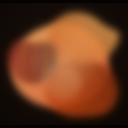
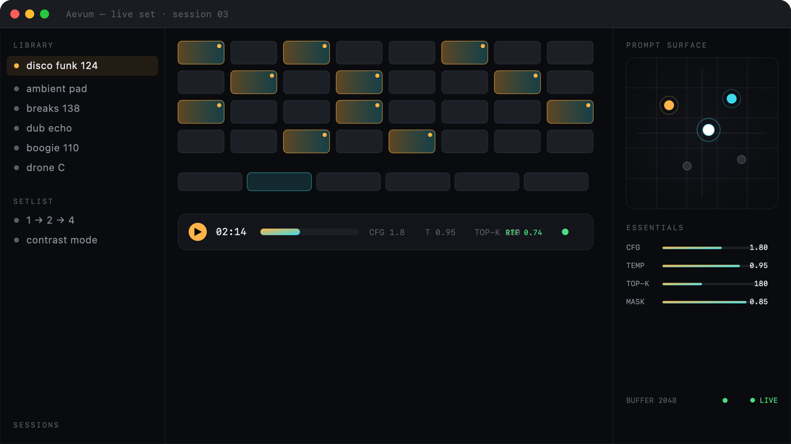

<p align="center">
  
</p>

<h1 align="center">Aevum</h1>

<p align="center">A macOS app for live AI music performance built on <a href="https://magenta.withgoogle.com/magenta-realtime-2">Magenta RealTime 2</a>. Load songs, auto-extract musical loops, morph between them in real time, and control every generation parameter live with a MIDI controller.</p>

<p align="center">
  <a href="https://github.com/shoegazerstella/aevum/releases/latest"></a>
  <a href="https://shoegazerstella.github.io/aevum"></a>
  <a href="https://huggingface.co/google/magenta-realtime-2"></a>
</p>

<p align="center">
  
</p>

> **Status:** Phase 1 complete. App builds, runs, and generates real-time audio on Apple Silicon.

## What it does

1. **Import songs** → drag in WAV/MP3/FLAC/M4A files. Beat-track each song, slice 2/4-bar candidates at downbeat boundaries, embed each with MusicCoCa, dedupe by similarity, rank by energy.
2. **Preview clips** → single-click any clip to hear the raw loop audio play through the engine's audio graph (loops until you stop it).
3. **Continue from a clip** → click "Continue" while previewing and the engine prefills its transformer state with the clip's audio (SpectroStream encode → KV cache). Generation then **continues from where the clip ends**, matching the clip's style via its MusicCoCa embedding.
4. **Morph in real time** → the Ableton-style clip grid launches loops into 6 blend slots (double-click). A 2D prompt-surface pad morphs between them via inverse-distance-weighted blending — Magenta generates the crossfade continuously. Blend changes re-blend MusicCoCa tokens on the next 25 Hz frame with **no audio dropouts** (no reset on every slider move).
5. **Scenes** → capture the current slot arrangement + prompt-surface positions + cursor as a named scene. Recall a scene to snap the whole morphing setup back to that state.
6. **Absolute live control** → every MRT2 parameter (CFG per modality, temperature, top-k, masking width, drumless, onset mode, MIDI gate) is exposed and MIDI-learnable. Play notes via a MIDI controller to steer pitch in real time.
7. **Setlist suggestions** → cosine similarity over 768-dim MusicCoCa embeddings. Three modes: *smooth* (greedy nearest-neighbor walk), *contrast* (max dissimilarity for dramatic morphs), *cluster* (hierarchical grouping into runs).
8. **Performance controls** → buffer size (latency vs resilience), quality presets (top-K + CFG), live RTF + buffer-fill + dropped-frame metrics so you can tune before generation corrupts.

## Architecture

```
Aevum.app (SwiftUI · macOS 14+ · Apple Silicon)
├── SwiftUI Layer
│   ├── ClipGridView        — Ableton-style clip/scene grid
│   ├── PromptSurfacePad    — 2D XY morph pad (IDW blend weights)
│   ├── ParamPanel          — tabbed (Essentials/Advanced): CFG/mask/temp/
│   │                         top-k/drumless/onset + performance panel
│   ├── SetlistView         — similarity-ordered setlist
│   ├── ImportWizard        — drop songs → loops
│   └── LibrarySidebar      — songs, loops, sessions
├── Audio/MIDI Layer
│   ├── AVAudioEngine + AVAudioSourceNode  — pulls 48k stereo from bridge
│   ├── AVAudioPlayerNode                  — preview clip audio (same graph)
│   └── CoreMIDI Manager                   — notes + CC → bridge setters
├── EngineBridge (Obj-C++ wrapper, Swift-facing)
│   └── owns magentart::core::RealtimeRunner
├── magentart::core  (C++ static lib, git submodule)
│   ├── RealtimeRunner  (inference thread, ring buffers, prompt blending,
│   │   MIDI gate, prefill, recording, save/load state)
│   └── MLXEngine + MusicCoCa TFLite assets (embeddings for similarity)
├── ImportPipeline (background queue)
│   └── decode → beat-track → slice 2/4-bar → MusicCoCa embed → rank
└── LoopLibrary (SQLite in App Support: songs, loops, embeddings, sessions)
```

## First-time setup

```sh
# 1. Clone with the magenta-realtime submodule:
git clone --recurse-submodules https://github.com/shoegazerstella/aevum.git
cd aevum

# 2. Install Xcode.app from the Mac App Store, then select it:
sudo xcode-select -s /Applications/Xcode.app/Contents/Developer

# 3. Install Homebrew packages:
brew install xcodegen

# 4. Create the Python venv + install magenta-rt[mlx] and cmake<3.28:
uv venv --python 3.12 .venv
source .venv/bin/activate
uv pip install "magenta-rt[mlx]" "cmake<3.28"

# 5. Download model assets to ~/.cache/magenta-rt-v2:
mkdir -p ~/.cache/magenta-rt-v2
export MAGENTA_HOME=~/.cache
mrt models init --download-path ~/.cache/magenta-rt-v2
mrt models download mrt2_small --download-path ~/.cache/magenta-rt-v2
```

If you already cloned without `--recurse-submodules`, run:

```sh
git submodule update --init --recursive
```

The `~/Documents/Magenta/` default download path is TCC-protected on a
fresh macOS terminal; `~/.cache` avoids the permission prompt.

## Build & run

```sh
./build.sh          # build engine + app
./build.sh run      # build + launch
./build.sh engine   # just the C++ engine static lib
./build.sh app      # just the Xcode app (assumes engine is built)
./build.sh release  # build Release + package a distributable DMG
./build.sh clean    # wipe all build artifacts
```

The first `./build.sh engine` takes 10–20 minutes (MLX + TFLite +
SentencePiece from source). Subsequent runs are incremental.

## Distribution

`./build.sh release` produces `build/release/Aevum-<version>.dmg` — an
unsigned, drag-to-install DMG (Aevum.app + Applications symlink). The DMG
is ~45 MB; the app is ~130 MB.

The app ships without the ~1.8 GB of model weights. On first launch it
detects that the assets are missing from `~/.cache/magenta-rt-v2` and
shows a download screen that fetches them from HuggingFace
(`google/magenta-realtime-2`). Users who already ran `mrt models init` +
`mrt models download mrt2_small` won't re-download — the manifest checks
file presence and byte size.

Because the app is unsigned, the first launch needs a one-time Gatekeeper
bypass: right-click → Open → confirm. This is documented on the landing
page at `docs/index.html` (served via GitHub Pages from the `/docs`
folder).

To publish a release:
1. `./build.sh release`
2. Create a GitHub Release (or push a `v*` tag — the `.github/workflows/release.yml`
   Action builds and attaches the DMG automatically).
3. Enable GitHub Pages on the repo: Settings → Pages → Source → `main` / `/docs`.

## Using it

| Action | What happens |
|---|---|
| **Drag audio files into the importer** | Decodes, beat-tracks, slices loops, extracts MusicCoCa embeddings, saves to library |
| **Single-click a clip** | Previews the raw loop audio (loops until clicked again) |
| **Click "Continue" while previewing** | Prefills the engine with the clip → generation continues from the clip's end |
| **Double-click a clip** | Adds/removes the clip as a style prompt in a blend slot |
| **Drag the cursor on the prompt surface** | Morphs between loaded clips (inverse-distance-weighted blend) |
| **Drag slot dots on the prompt surface** | Rearranges the blend space |
| **Click `+` in the scene strip** | Captures the current slot + pad arrangement as a scene |
| **Click a scene's play button** | Recalls the arrangement (loads clips, restores positions + cursor) |
| **Space** | Play / stop generation |
| **R** | Reset engine |
| **Cmd + I** | Import songs |

## Performance tuning

If generation sounds corrupted (dropouts, glitches, or the RTF badge in the
toolbar stays red):

1. **Switch the Quality preset to "Performance"** in the Advanced tab — lowers top-K + CFG, less compute per frame.
2. **Increase the Buffer size** (Advanced tab) — 2048 (default, ~42ms latency) → 8192 (~170ms). More latency but tolerates GPU hiccups without underrunning.
3. **Watch the RTF badge** (toolbar, top-right) — it must stay `<1.0×`. The 40ms budget per frame at 25 Hz is the real-time threshold.
4. **Check dropped frames** — if the count climbs, the inference thread can't keep pace. Lower quality or raise the buffer.

The prefill ("Continue from here") blocks the inference loop for 2–5 seconds
while it encodes the clip and populates the transformer's KV cache. The play
button is disabled during prefill and the transport bar shows live log lines.

Clips shorter than 3 seconds can't be prefilled — the runner trims 1s from
each end (SpectroStream encoder edges are unreliable), leaving too little
audio. You'll see a log message instead of a crash.

## Hardware

- **`mrt2_small`** (230M params) — real-time on any Apple Silicon Mac.
- **`mrt2_base`** (2.4B params) — requires M2 Max / M3 Pro / M4 Pro or higher for real-time; higher quality.

The app uses `mrt2_small` by default. To switch to `mrt2_base`, download
it (`mrt models download mrt2_base`) and change `modelPath` in
`Sources/AevumApp/AevumApp.swift`.

## Keyboard shortcuts

| Key | Action |
|---|---|
| Space | Play / stop |
| R | Reset engine |
| Cmd + I | Import songs |

## Project layout

```
aevum/
├── AGENTS.md              — build/lint/test commands for agents
├── README.md              — this file
├── STATUS.md              — phased roadmap + build state
├── LICENSE                — MIT
├── CITATION.bib           — papers to cite (Magenta RT 2 + components)
├── build.sh               — top-level orchestrator (engine|app|run|release|clean)
├── project.yml            — XcodeGen config
├── docs/                  — landing page (GitHub Pages source)
├── logo/                  — cover artwork + icon master
├── scripts/
│   └── build_engine.sh    — CMake build + merge into libaevum_engine.a
├── magenta-realtime/      — submodule (upstream, Apache-2.0)
├── .venv/                 — Python 3.12 venv (not tracked)
└── Aevum/Sources/
    ├── AevumApp/          — @main entry, bridging header, plist, entitlements
    ├── Engine/            — EngineBridge (Obj-C++), AudioEngine, MIDIManager, EngineController
    ├── Models/            — Song, Loop, Session, Setlist, Scene, MIDIMap
    ├── Storage/           — LibraryStore (SQLite)
    ├── Import/            — AudioDecoder, BeatTracker, LoopExtractor, EmbeddingExtractor
    ├── Similarity/        — SimilarityEngine, SetlistSuggester
    ├── UI/                — Theme, ContentView, ClipGridView, PromptSurfacePad,
    │                       ParamPanel, SetlistView, LibrarySidebar, ImportWizard, WaveformView
    └── Utility/           — WavWriter
```

## Citations

Aevum is an independent third-party front-end for Magenta RealTime 2 and is not affiliated with or endorsed by Google. The underlying model and its components are described in the papers below — please cite them when you publish work that uses Aevum or Magenta RealTime 2. Full BibTeX in [`CITATION.bib`](CITATION.bib).

- **Live Music Models** — Caillon, McWilliams, Tarakajian, Simon, Manco, Engel, Constant, Li, Denk, … Roberts. NeurIPS Creative AI Workshop, 2025. [arXiv:2508.04651](https://arxiv.org/abs/2508.04651) — the primary citation for Magenta RealTime (per Google's model card; the MRT2 paper is forthcoming).
- **SpectroStream: A Versatile Neural Codec for General Audio** — Li, Han, McWilliams, Borsos, Tagliasacchi. 2025. [arXiv:2508.05207](https://arxiv.org/abs/2508.05207) — the audio codec.
- **MuLan: A Joint Embedding of Music Audio and Natural Language** — Huang, Jansen, Lee, Ganti, Li, Ellis. ISMIR, 2022. [arXiv:2208.12415](https://arxiv.org/abs/2208.12415) — joint audio-text embeddings (MusicCoCa builds on this).
- **CoCa: Contrastive Captioners are Image-Text Foundation Models** — Yu, Wang, Vasudevan, Yeung, Seyedhosseini, Wu. 2022. [arXiv:2205.01917](https://arxiv.org/abs/2205.01917) — the contrastive-captioner architecture MusicCoCa builds on.

## License

Aevum's source code is released under the **MIT License** — see [LICENSE](LICENSE).

The bundled [`magenta-realtime`](https://github.com/magenta/magenta-realtime) submodule is **Apache-2.0**. Model weights for Magenta RealTime 2 are released by Google under **CC-BY-4.0** (see [HuggingFace](https://huggingface.co/google/magenta-realtime-2)). Downloading the weights through Aevum's first-run downloader is subject to Google's [Terms of Use](https://huggingface.co/google/magenta-realtime-2#terms-of-use).
